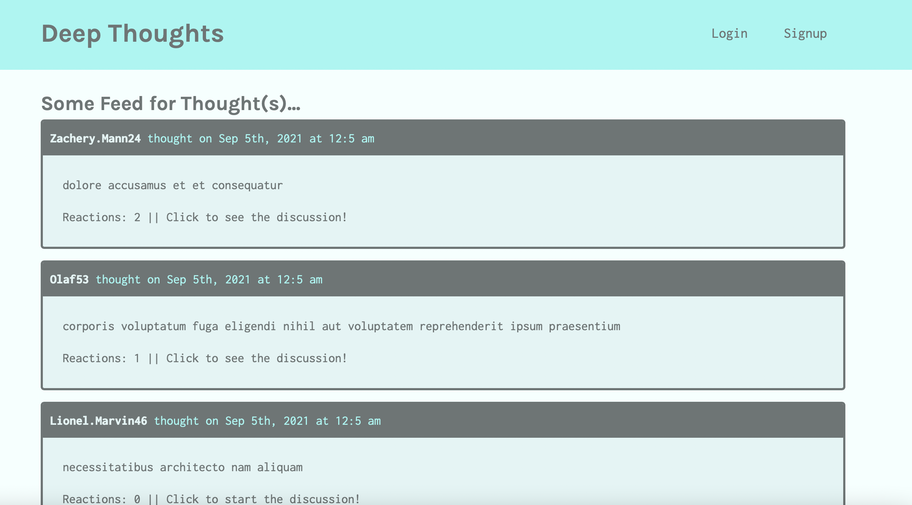
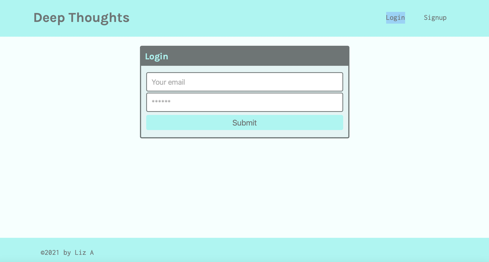
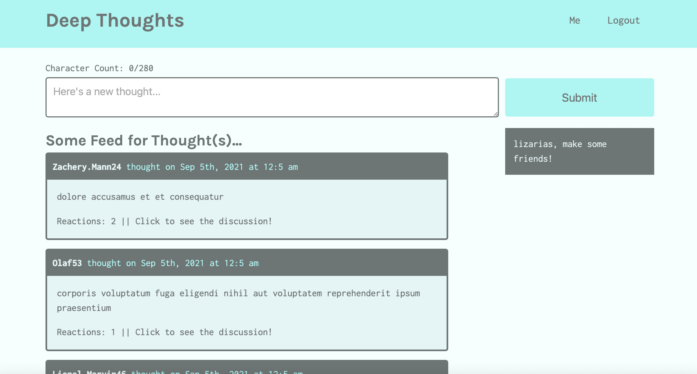
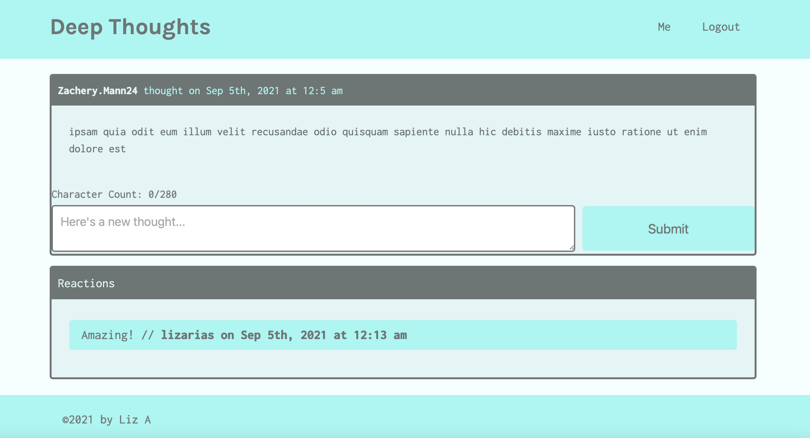

# Deep-thoughts

## Description
A MERN social media application called "Deep Thoughts," where users can create an account, post their thoughts for others to see, and interact with other users through these thoughts.

  ## Table of Contents

* [Deployment](#deployment)
* [License](#license)
* [Mock-up](#mockup)
* [Questions](#questions)

## Deployment
You can see the deployed Application [here](https://deep-thoughts-liz.herokuapp.com).

## License

## Mockup

## Questions
If you have any questions about this project, send me an email at lizethariasc14@gmail.com or contact me through my [GitHub](https://github.com/lizariasc).